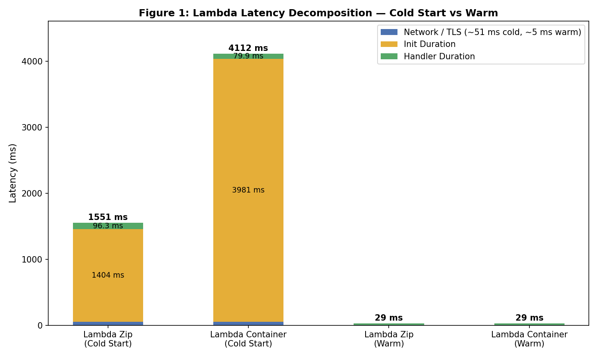
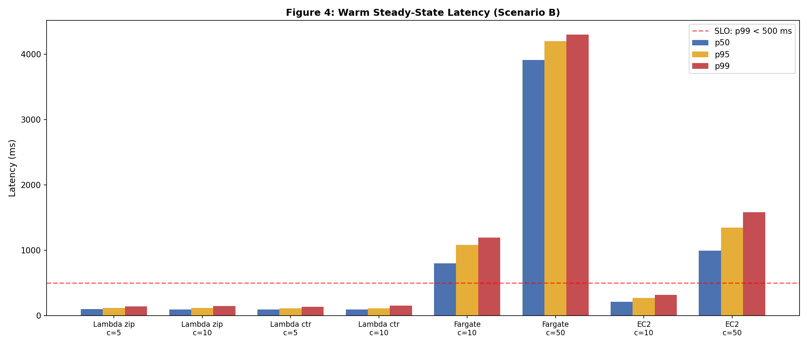
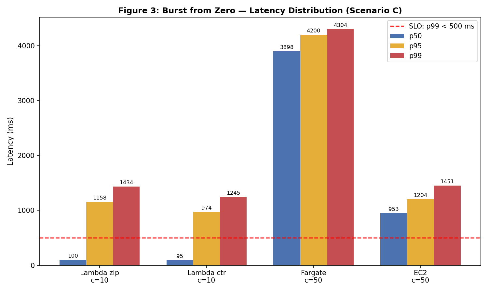
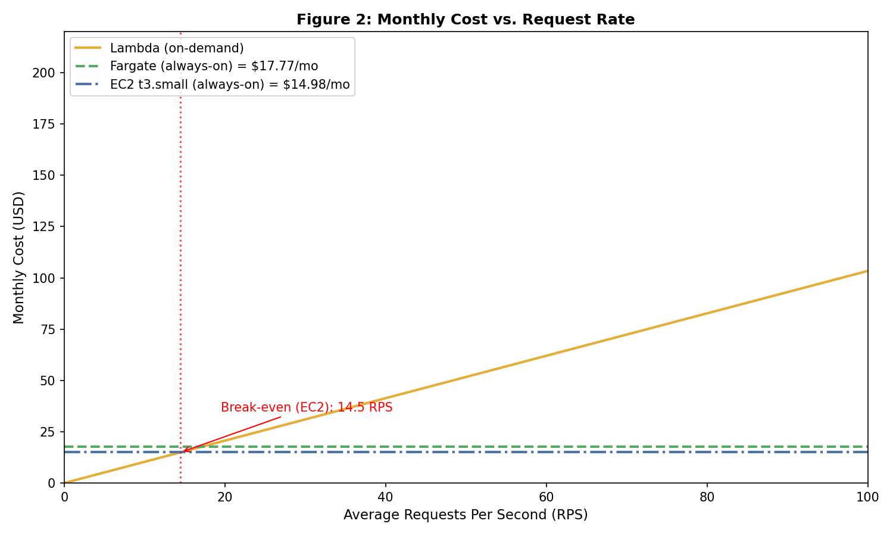

# AWS Cloud Lab — Serverless vs Containers: Latency and Cost Comparison

**Region:** us-east-1
**Load generator:** EC2 workstation (t3.small, ip-172-31-10-221) in the same region as all targets

---

## 1. Setup Verification (Assignment 1)

All four environments were deployed following the User Manual and verified by sending the same 128-dimensional query vector (seed=42) to each endpoint. The full terminal output is saved in `assignment-1-endpoints.txt`.

| Target | Environment | Status |
|---|---|---|
| Lambda (zip) | `lsc-knn-zip` via `aws lambda invoke` | 200 OK |
| Lambda (container) | `lsc-knn-container` via `aws lambda invoke` | 200 OK |
| Fargate | ALB `lsc-knn-alb-1742105879.us-east-1.elb.amazonaws.com` | 200 OK |
| EC2 | `44.221.79.18:8080` | 200 OK |

All four endpoints returned **identical** k-NN results — the same five nearest neighbors with matching distances and indices:

```
index: 35859  distance: 12.0015
index: 24682  distance: 12.0599
index: 35397  distance: 12.4871
index: 20160  distance: 12.4895
index: 30454  distance: 12.4994
```

This confirms that all environments execute identical application logic (same dataset seed=0, same query seed=42).

---

## 2. Cold Start Characterization (Assignment 2)

### Data Sources

Cold start behavior was observed from two sources:

1. **Scenario A oha runs** (`scenario-a-zip.txt`, `scenario-a-container.txt`): 30 sequential requests at 1 req/sec to each Lambda variant after 20+ minutes idle. All returned HTTP 200. The single outlier in each run (the slowest request) corresponds to the cold start.
2. **CloudWatch REPORT lines** (`cloudwatch-zip-reports.txt`, `cloudwatch-container-reports.txt`): Provide Init Duration and Handler Duration breakdown for cold-start invocations triggered during Assignment 1 CLI verification.

### Scenario A Results

| Metric | Lambda Zip | Lambda Container |
|---|---|---|
| Cold-start request (oha slowest) | 1551 ms | 4112 ms |
| Warm p50 (oha) | 100 ms | 100 ms |
| Warm p95 (oha) | 149 ms | 158 ms |
| Cold starts observed | 1 / 30 | 1 / 30 |

### CloudWatch REPORT Decomposition (Assignment 1 invoke)

| Metric | Lambda Zip | Lambda Container |
|---|---|---|
| Init Duration | 639.78 ms | 2888.32 ms |
| Handler Duration | 96.30 ms | 79.94 ms |
| Total server-side | 736.08 ms | 2968.26 ms |
| Max Memory Used | 144 MB / 512 MB | 142 MB / 512 MB |

### Latency Decomposition



The cold-start bar heights are derived from the Scenario A oha-measured total latency (1551 ms zip, 4112 ms container). The Init Duration component is estimated by subtracting DNS+TLS overhead (~51 ms) and Handler Duration (from CloudWatch) from the total. The Scenario A Init estimates (~1404 ms zip, ~3981 ms container) are higher than the CloudWatch samples (~640 ms, ~2888 ms), reflecting natural variance in cold start initialization times across invocations.

For warm invocations, latency is approximately 29 ms (in-region RTT ~5 ms + server computation ~24 ms).

### Analysis

**Container cold starts are significantly slower than zip.** The container variant (4112 ms) is 2.7x slower than zip (1551 ms) at the client. This is expected:

- **Zip deployment:** Lambda downloads a small zip package (~10 MB) and a pre-cached dependency layer. The runtime initializes Python 3.12, imports libraries, and generates the in-memory dataset.
- **Container deployment:** Lambda must pull and extract the full Docker image from ECR (~300+ MB uncompressed). Although Lambda caches container images after the first pull, the initial extraction and layer decompression dominate Init Duration.

Both variants use similar memory (~144 MB peak) and have comparable handler durations (~80–96 ms for the first invocation), confirming the performance difference is entirely in the initialization phase.

Both cold starts exceed the p99 < 500 ms SLO: zip by 3.1x and container by 8.2x.

---

## 3. Warm Steady-State Throughput (Assignment 3)

### Data Source

Scenario B used `oha` from the in-region EC2 workstation. All endpoints returned HTTP 200. Lambda was tested at c=5 and c=10 (AWS Academy limit); Fargate/EC2 at c=10 and c=50.

Server-side `query_time_ms` was sampled from response bodies during Assignment 1: Fargate = 24.17 ms, EC2 = 23.53 ms. Lambda performs the same k-NN computation, so server-side handler time is comparable.

### Latency Table

| Environment | Concurrency | p50 (ms) | p95 (ms) | p99 (ms) | Server avg (ms) |
|---|---|---|---|---|---|
| Lambda (zip) | 5 | 98 | 118 | 138 | ~24 |
| Lambda (zip) | 10 | 96 | 119 | 147 | ~24 |
| Lambda (container) | 5 | 94 | 113 | 136 | ~24 |
| Lambda (container) | 10 | 93 | 112 | 151 | ~24 |
| Fargate | 10 | 798 | 1084 | 1192 | ~24 |
| Fargate | 50 | 3914 | 4202 | 4305 | ~24 |
| EC2 | 10 | 209 | 272 | 320 | ~24 |
| EC2 | 50 | 992 | 1346 | 1581 | ~24 |



### Tail Latency Check (p99 > 2x p95)

| Environment | Concurrency | p99/p95 | Flag |
|---|---|---|---|
| Lambda (zip) | 5 | 138/118 = 1.17 | No |
| Lambda (zip) | 10 | 147/119 = 1.24 | No |
| Lambda (container) | 5 | 136/113 = 1.20 | No |
| Lambda (container) | 10 | 151/112 = 1.35 | No |
| Fargate | 10 | 1192/1084 = 1.10 | No |
| Fargate | 50 | 4305/4202 = 1.02 | No |
| EC2 | 10 | 320/272 = 1.18 | No |
| EC2 | 50 | 1581/1346 = 1.17 | No |

No environment triggers the 2x tail latency instability flag. Latency distributions are relatively tight, dominated by predictable queuing rather than sporadic outliers.

### Analysis

**Lambda p50 barely changes between c=5 and c=10.** Zip goes from 98 ms to 96 ms; container from 94 ms to 93 ms. This is because each Lambda request gets its own execution environment — there is no shared queue. Doubling concurrency simply doubles the number of parallel environments, not the per-request latency.

**Fargate/EC2 p50 increases dramatically at c=50.** Fargate goes from 798 ms (c=10) to 3914 ms (c=50), a 4.9x increase. EC2 goes from 209 ms to 992 ms (4.7x). Both environments run a single container serving requests sequentially (or with limited concurrency), so at higher load, requests queue up and wait for earlier ones to finish.

**Gap between server-side ~24 ms and client-side p50:**
- **Lambda (zip, c=5):** p50 = 98 ms. The ~74 ms overhead includes SigV4 signing verification, Lambda platform routing, TLS, and in-region network RTT. DNS+dialup (first connection) was ~52 ms.
- **Fargate (c=10):** p50 = 798 ms vs. server 24 ms — a 774 ms gap caused by request queuing on a single 0.5 vCPU task. With 10 concurrent requests each taking ~24 ms of compute, queuing dominates.
- **EC2 (c=10):** p50 = 209 ms vs. server 24 ms — a 185 ms gap. EC2 has 2 vCPUs (vs Fargate's 0.5 vCPU), so it can process requests faster in parallel, reducing queue depth relative to Fargate.

**SLO assessment (p99 < 500 ms):** Lambda at both concurrency levels (p99 = 136–151 ms) and EC2 at c=10 (p99 = 320 ms) meet the SLO. Fargate violates it at all concurrency levels. EC2 at c=50 (p99 = 1581 ms) also violates it.

---

## 4. Burst from Zero (Assignment 4)

### Data Source

Scenario C fired 200 requests simultaneously to all four targets after Lambda had been idle 20+ minutes. Lambda was tested at c=10 (Academy limit); Fargate/EC2 at c=50.

### Burst Latency Distribution

| Environment | Concurrency | p50 (ms) | p95 (ms) | p99 (ms) | Max (ms) |
|---|---|---|---|---|---|
| Lambda (zip) | 10 | 100 | 1158 | 1434 | 1789 |
| Lambda (container) | 10 | 95 | 974 | 1245 | 1459 |
| Fargate | 50 | 3898 | 4200 | 4304 | 4309 |
| EC2 | 50 | 953 | 1204 | 1451 | 1489 |



### Analysis

**No environment meets the p99 < 500 ms SLO under burst.**

**Lambda exhibits a clear bimodal distribution.** The histogram shows two clusters:
- **Warm cluster (majority):** ~80–250 ms (requests served by pre-existing or quickly provisioned warm environments)
- **Cold-start cluster (tail):** ~1200–1800 ms (zip) or ~700–1500 ms (container)

For Lambda zip, 188/200 requests completed under 246 ms, while ~10 requests took 1.2–1.8 s (cold starts). This pushes p95 to 1158 ms and p99 to 1434 ms. The bimodal split is the signature of Lambda cold starts under burst: most requests are fast, but newly provisioned environments add a fixed initialization penalty.

**Fargate's burst latency (p99 = 4304 ms) is the worst** because 200 requests at c=50 pile up on a single 0.5 vCPU task. The queue drains at ~24 ms per request, so the 200th request waits roughly 200 × 24 / (0.5 vCPU throughput) ≈ 4+ seconds.

**EC2 (p99 = 1451 ms)** performs better than Fargate under burst due to 2 vCPUs allowing some genuine parallelism, but still violates the SLO due to queuing on a single instance.

**What would be needed to meet the SLO under burst:**
- **Lambda:** Provisioned concurrency (10 environments) eliminates cold starts. Warm Lambda p50 of ~100 ms easily meets the SLO.
- **EC2:** An Auto Scaling Group with multiple instances behind a load balancer would distribute burst traffic and reduce per-instance queue depth.
- **Fargate:** More tasks (3–5 at 1 vCPU each) behind the ALB, or ECS Service Auto Scaling.

---

## 5. Cost at Zero Load (Assignment 5)

### AWS Pricing (us-east-1)

Pricing was verified from official AWS pricing pages. Screenshots with dates are saved in `results/figures/pricing-screenshots/`.

| Resource | Price |
|---|---|
| Lambda requests | $0.20 per 1M requests |
| Lambda compute | $0.0000166667 per GB-second |
| Fargate vCPU | $0.04048 per vCPU-hour |
| Fargate memory | $0.004445 per GB-hour |
| EC2 t3.small | $0.0208 per hour |

### Idle Cost Computation

| Environment | Hourly idle cost | Monthly idle cost (24/7) |
|---|---|---|
| Lambda | $0.00 | **$0.00** |
| Fargate (0.5 vCPU, 1 GB) | $0.02469 | **$17.77** |
| EC2 (t3.small) | $0.02080 | **$14.98** |

**Fargate:** 0.5 × $0.04048 + 1.0 × $0.004445 = $0.02469/hr × 720 hr = **$17.77/month**

**EC2:** $0.0208/hr × 720 hr = **$14.98/month**

### Analysis

**Lambda has zero idle cost** because it is billed purely per invocation. This is the fundamental advantage of serverless: cost scales to zero with traffic.

Fargate and EC2 incur the same cost whether serving traffic or idle. Under the traffic model (18 hours/day idle, 6 hours/day active), the idle portion accounts for 75% of the monthly bill but generates zero value.

EC2 is $2.79/month cheaper than Fargate ($14.98 vs $17.77) despite providing 4x the CPU (2 vCPU vs 0.5) and 2x the memory (2 GB vs 1 GB). This reflects Fargate's premium for managed container orchestration.

---

## 6. Cost Model, Break-Even, and Recommendation (Assignment 6)

### Traffic Model

| Period | Duration | RPS | Requests/day |
|---|---|---|---|
| Peak | 30 min (1800 s) | 100 | 180,000 |
| Normal | 5.5 hr (19,800 s) | 5 | 99,000 |
| Idle | 18 hr | 0 | 0 |
| **Total** | **24 hr** | | **279,000** |

**Monthly requests:** 279,000 × 30 = **8,370,000**

**Average RPS over 24 hours:** 279,000 / 86,400 = **3.23 RPS**

### Lambda Monthly Cost

Using handler duration = 23.85 ms (average of Fargate/EC2 `query_time_ms`) and memory = 512 MB (0.5 GB):

```
Request cost  = 8,370,000 × ($0.20 / 1,000,000)
              = $1.67

GB-seconds    = 8,370,000 × 0.02385 × 0.5
              = 99,812 GB-s

Compute cost  = 99,812 × $0.0000166667
              = $1.66

Total Lambda  = $1.67 + $1.66
              = $3.33/month
```

### Always-On Monthly Cost

```
Fargate = $17.77/month  (same regardless of traffic)
EC2     = $14.98/month  (same regardless of traffic)
```

### Break-Even Analysis

The break-even point is where Lambda's variable cost equals the always-on fixed cost:

```
Per-request Lambda cost:
  C_req     = $0.20 / 1,000,000                = $0.0000002
  C_compute = 0.02385 × 0.5 × $0.0000166667    = $0.000000199
  C_total   = $0.000000399 per request

Lambda monthly = R × 2,592,000 × $0.000000399

Break-even vs EC2:
  R × 2,592,000 × $0.000000399 = $14.98
  R = $14.98 / $1.034
  R ≈ 14.5 RPS

Break-even vs Fargate:
  R × 2,592,000 × $0.000000399 = $17.77
  R = $17.77 / $1.034
  R ≈ 17.2 RPS
```

At the traffic model's average of **3.23 RPS**, Lambda costs **$3.33/month** — 4.5x cheaper than EC2 and 5.3x cheaper than Fargate.



### Recommendation

**For the given traffic model (avg 3.23 RPS) and SLO (p99 < 500 ms), I recommend Lambda (zip deployment) for steady-state traffic, with provisioned concurrency or an EC2 fallback to handle burst scenarios.**

**Rationale:**

1. **Cost:** Lambda is by far the cheapest at this traffic level ($3.33/month vs $14.98 for EC2 and $17.77 for Fargate). The average RPS of 3.23 is well below the break-even of 14.5 RPS.

2. **Warm-state SLO compliance:** Lambda meets p99 < 500 ms comfortably during steady-state operation. At c=10, Lambda zip p99 = 147 ms and container p99 = 151 ms — both well within the 500 ms target. This is the best SLO performance of any environment tested, because each request runs in its own isolated execution environment with no queuing.

3. **Burst limitation:** Under burst from zero (Scenario C), Lambda cold starts push p99 to 1434 ms (zip) / 1245 ms (container), violating the SLO. However, the bimodal distribution shows that 94%+ of burst requests still complete within ~250 ms — only the cold-start tail exceeds the SLO.

4. **Mitigation for burst:**
   - **Provisioned concurrency (10 environments):** Eliminates cold starts entirely. Cost = 10 × 0.5 GB × $0.0000097315/GB-s × 2,592,000 s/month ≈ **$126/month** — significantly more expensive, justified only if burst SLO compliance is strictly required.
   - **Scheduled warm-up:** Send a few requests before anticipated peak periods to pre-warm environments. Zero additional cost but requires traffic predictability.
   - **EC2 fallback:** If burst SLO is strictly required and cost must stay low, EC2 ($14.98/month) with an Auto Scaling Group behind an ALB meets p99 < 500 ms at c=10 (p99 = 320 ms) and can scale out for peaks.

**When would this recommendation change?**

- **If average load exceeds ~14.5 RPS:** Lambda becomes more expensive than EC2. At sustained high traffic, EC2 or Fargate with proper scaling is more cost-effective.
- **If the SLO is relaxed to p99 < 1500 ms:** Lambda meets the SLO even under burst (p99 = 1434 ms for zip). No provisioned concurrency needed.
- **If the SLO tightens to p99 < 100 ms:** Only Lambda warm invocations qualify (p50 ~96 ms), and even then it's marginal. All other environments fail.
- **If traffic becomes truly unpredictable:** Lambda's per-request billing and automatic scaling make it the safest choice. Always-on environments risk either over-provisioning (wasted cost) or under-provisioning (SLO violations).
